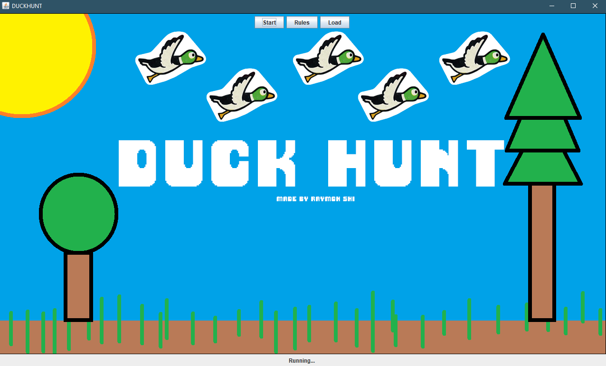
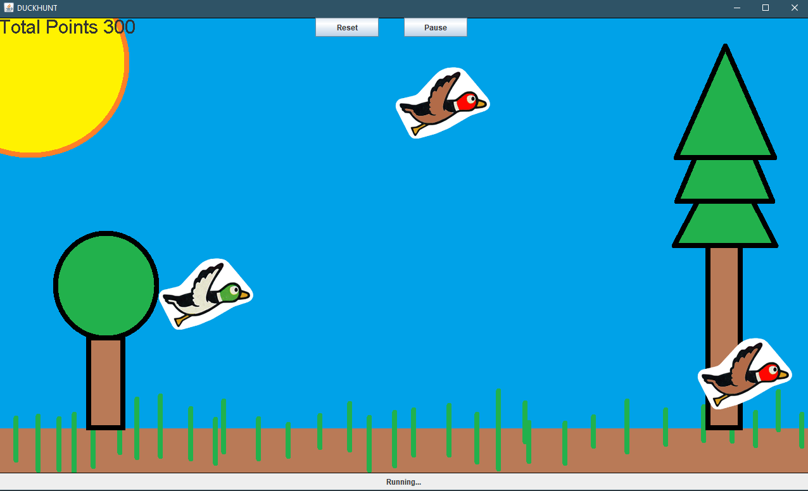
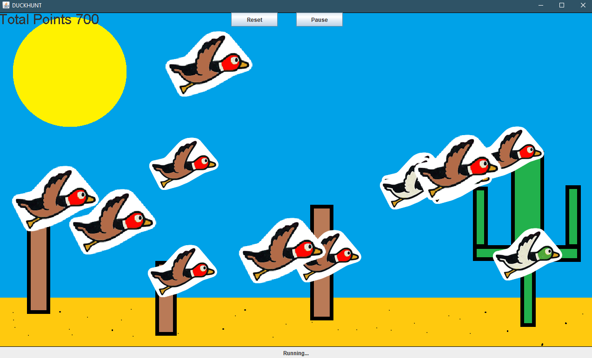
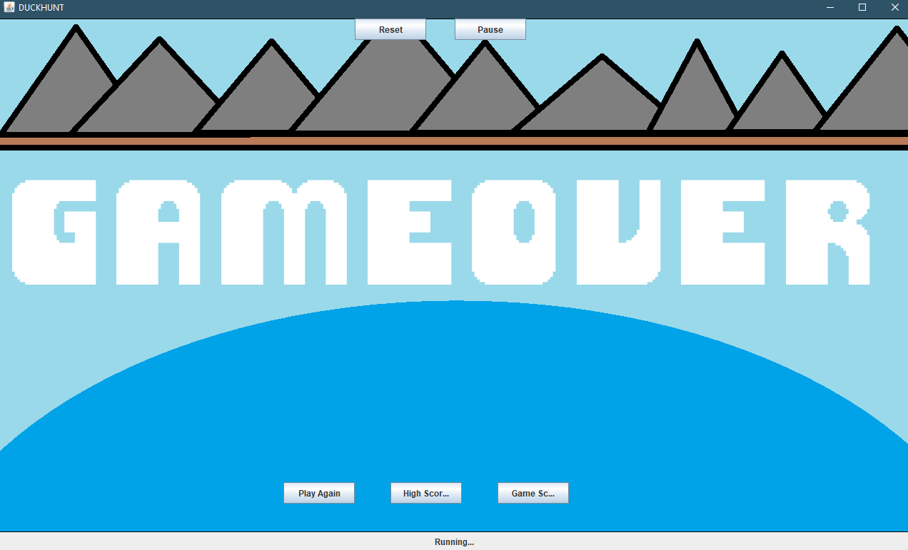

# DuckHunt Game
A rendition of the retro shooter game DuckHunt. This game was built on Jave 1.8.

## Pictures of the Game
### The Title Screen
 

### The game features two types of birds, Ducks and Chickens. Ducks will give you points, whereas clicking on a Chicken will deduct points.
 

### Additionally, clicking a Chicken will rapidly spawn more chickens to clutter up the screen for a set amount of time!


### Failure to kill a bird in a set amount of time or reaching negative points will result in game over!


## Files
### Bird.java
```
An interface that extends the Shape interface. This interface lays the groundwork for
the two other bird classes.
```
### Chicken.java
```
The Chicken class implements the Bird interface and extends Rectangles. This class
contains all functions that related to the Chicken objects.
```
### Duck.java
```
The Duck class implements the Bird interface and extends Rectangles. This class
contains all functions that related to the Duck objects.
```
### Game.java
```
This class contains the main function and creates the GUI/Game Canvas.
```
### Game_Canvas.java
```
This class deals with all game board related activites 
(drawing birds, setting timers, making buttons, painting backgrounds, etc...).
```
### Game_TEST.java
```
This class is used to perform JUnit 4 testing for the game.
```
### GameStates.java
```
This class contains all the different game states.
```
### MouseClickListener.java
```
This class implements MouseListener and contains functions used to detect mouse clicks and mouse movements.
```
### DataManager.java
```
This class is used to manage save and load data files.
```
### SavedData.java
```
This class is used save the state of the game.
```
